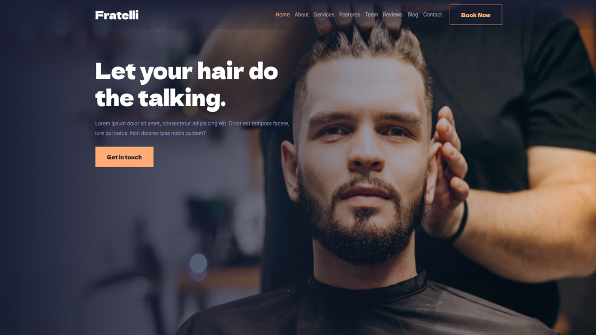

# Fratelli Barber Shop Landing Page

## Project Overview

Welcome to the Fratelli Barber Shop landing page, a fully responsive web application designed to showcase the charm and services of our esteemed barber shop.

The primary aim of this project was to elevate my HTML and CSS skills, with a specific focus on mastering the Bootstrap CSS framework. 

### Key Features

- Responsive design ensuring optimal viewing across various devices
- Elegantly crafted layout to reflect the unique personality of Fratelli Barber Shop

## Getting Started

Explore the landing page by following these simple steps:

1. Clone this repository: `git clone https://github.com/drstrangelove193/Fratelli-barber-shop.git`
2. Open `index.html` in your preferred web browser.

## Design Approach

I sought to create a visually stunning and user-friendly experience that captures the essence of Fratelli Barber Shop. By leveraging Bootstrap, I seamlessly integrated modern design principles with enhanced responsiveness.

## Deployment

The landing page is hosted using Netlify, providing a seamless and accessible way to explore the world of Fratelli Barber Shop.

## Lessons and Growth

The process of crafting this landing page significantly bolstered my HTML and CSS skills, solidifying my proficiency in working with Bootstrap. The project also deepened my appreciation for responsive design and its impact on user engagement.

## Contact

For inquiries or feedback, please feel free to reach out to me at giorgioragvelidze1@gmail.com

